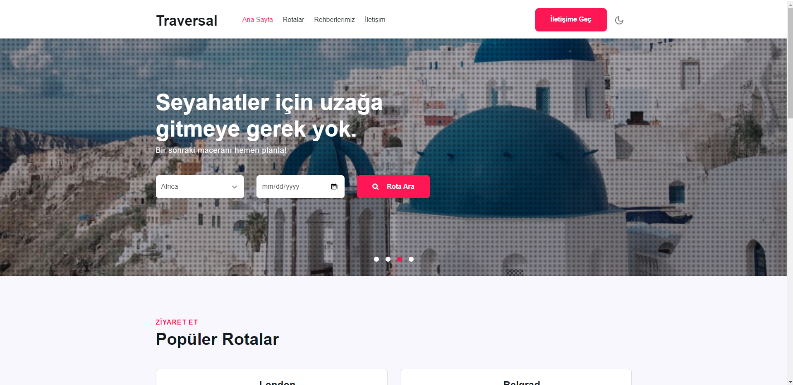
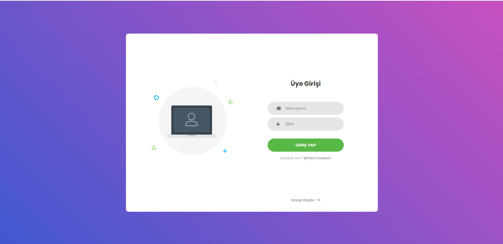
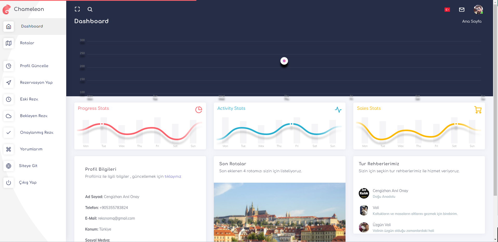
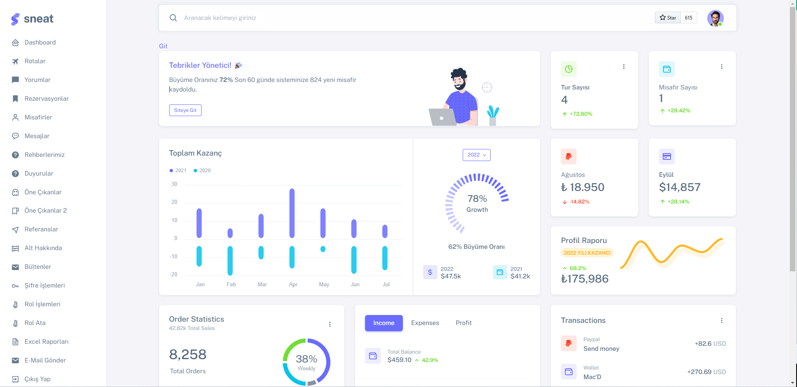
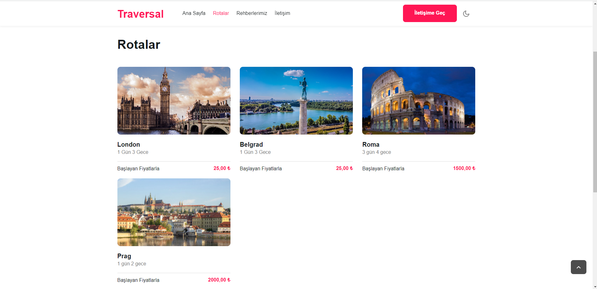
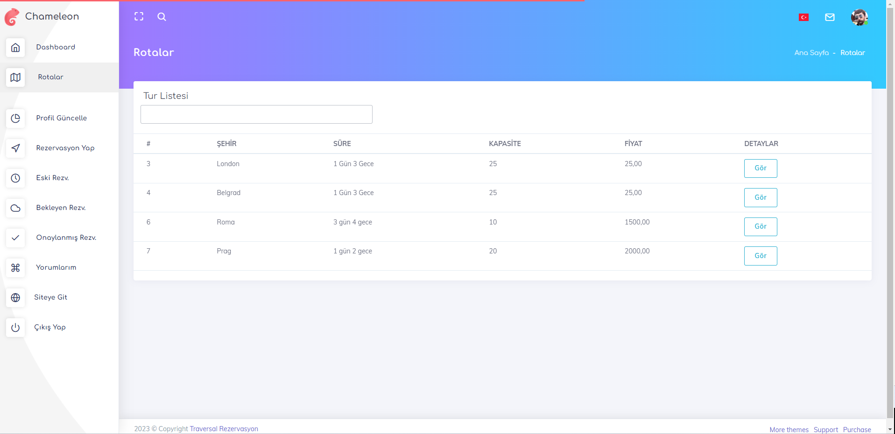

## Traversal Rezervasyon Projesi
Traversal projesi youtubede **Murat Yücedağ** tarafından oluşturulan **.NET Core** için 100 derslik  bir eğitim serisidir.Bu seri boyunca bir çok yeni teknoloji ,yöntem ve design pattern öğrendim. 

## Öğrendiğim & Kullandığım Teknolojiler
- ASP.NET Core MVC
- **Entity Framework**
- **N Tier Mimari**
- Repository Design Pattern
- **SignalR**  (Gerçek Zamanlı Veri İletimi)
- **Identity Kütüphanesi**
- **Localization** (Çoklu Dil Desteği) Kullanımı
- Custom Middleware Oluşturma
- CQRS , MediatR Design Pattern
- Uow (Unit Of Work) Design Pattern
- Mapping Kullanımı
- Fluent Validation Kullanımı
- Dependency Injection , Injection Design Pattern
- View Components & Layout Partial Kullanımları

